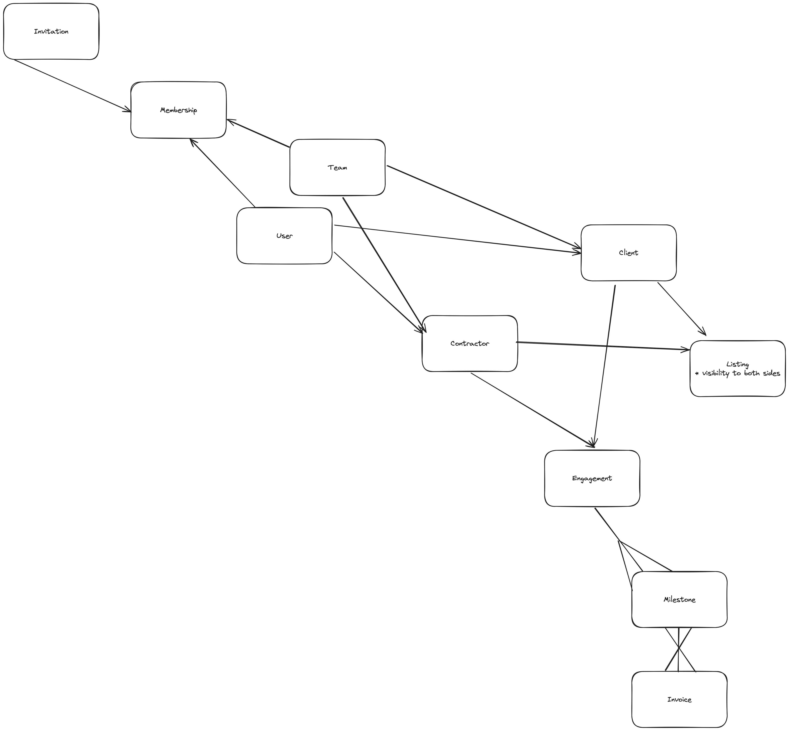

Partly Data Model
====

The Partly data model includes a few key objects:

Users and Teams - users represent a person who can log into Partly. Teams represent a group of users.

A team OR a user can be either a client or a contractor. 

Client - the person or team who is paying for the job. 
Contractor - the person or team who does the job.

Each "job" done by the contractor for the client is called an engagement. 

Engagements have milestones (a unit of discrete work). And milestones plural are added to an invoice. Invoices are what is paid by the client. 

